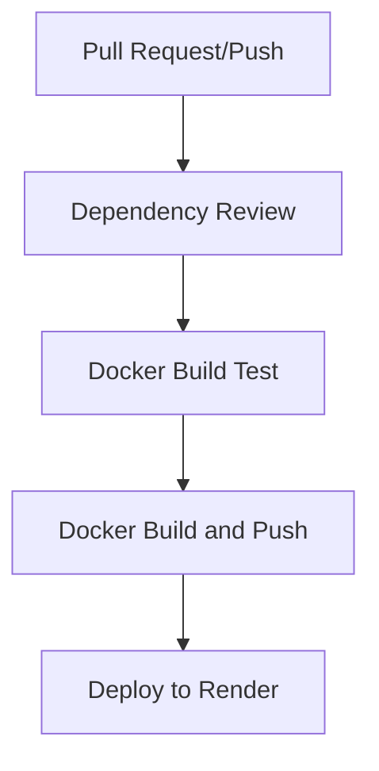

# Regras do Fluxo GitHub Actions

## 1. Visão Geral do Fluxo

## 2. Etapas do Fluxo

### 2.1 Dependency Review

- **Quando**: Pull Requests para `main`
- **O que faz**:
  - Verifica dependências em busca de vulnerabilidades
  - Falha se encontrar vulnerabilidades de alta severidade
  - Executa verificação de segurança com `safety check`

### 2.2 Docker Build Test

- **Quando**: Pull Requests e Push para `main`
- **O que faz**:
  - Verifica se o Dockerfile está correto
  - Testa a construção da imagem
  - Valida as dependências Python
  - Executa testes unitários

### 2.3 Docker Build and Push

- **Quando**: Push para `main` ou tags `v*.*.*`
- **O que faz**:
  - Executa testes Python
  - Constrói a imagem Docker
  - Publica no GitHub Container Registry (ghcr.io)
  - Usa cache para otimizar builds
  - Tags geradas automaticamente:
    - `latest` para branch principal
    - `v1.2.3` para tags semânticas
    - SHA do commit

### 2.4 Deploy to Render

- **Quando**: Após sucesso do Docker Build Test na `main`
- **O que faz**:
  - Verifica credenciais do Render
  - Inicia deploy via API
  - Monitora status do deploy
  - Verifica saúde do serviço

## 3. Regras Importantes

1. **Segurança**:

   - Todas as dependências são verificadas
   - Credenciais são armazenadas como secrets
   - Permissões mínimas necessárias

2. **Performance**:

   - Cache do Docker é utilizado
   - Builds paralelos quando possível
   - Timeout de 15 minutos por job

3. **Qualidade**:

   - Testes são obrigatórios
   - Build deve passar antes do deploy
   - Health check após deploy

4. **Versionamento**:
   - Tags semânticas (v1.2.3)
   - Latest sempre atualizado
   - SHA do commit para rastreabilidade

## 4. Secrets Necessários

- `RENDER_API_KEY`: Chave API do Render
- `RENDER_SERVICE_ID`: ID do serviço no Render
- `GITHUB_TOKEN`: Automático para GitHub Actions

## 5. Troubleshooting

### 5.1 Falhas Comuns

1. **Dependency Review**:

   - Verificar `requirements.txt`
   - Atualizar dependências vulneráveis

2. **Docker Build**:

   - Verificar Dockerfile
   - Validar cache do Docker
   - Checar espaço em disco

3. **Deploy**:
   - Verificar credenciais Render
   - Validar logs do serviço
   - Checar health check

### 5.2 Soluções

- Limpar cache se build falhar
- Reexecutar testes localmente
- Verificar logs do Render
- Validar variáveis de ambiente
